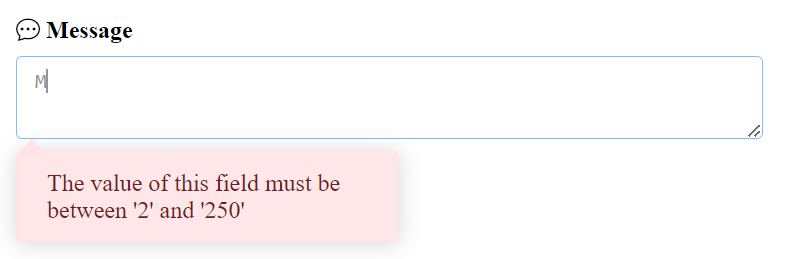

# Pourquoi Quickv ?

**Quickv** (prononcé "**cue-v**" en français) est une bibliothèque JavaScript conviviale spécialement conçue pour faciliter la validation dynamique des formulaires HTML sur vos pages web.

Elle a été conçue pour éliminer la rédondance, la perte du temps, la complexité dans le processus de validation d'un formulaire. En utilisant des attributs HTML intuitifs, cette bibliothèque permet d'ajouter des règles de validation complexes et avancés sans la nécessité de coder des fonctions. Elle s'aligne sur la logique naturelle de la validation HTML, rendant le processus simple, familier et fluide.

**Quickv** peut-être est une excellente option si vous recherchez une solution rapide pour mettre en place une validation complexe sur votre site sans avoir à écrire de code JavaScript, cela peu importe votre niveau en développement web.

## Exemple de validation
```html
 <form id="myForm" > 
      <div>
        <label class="label">Téléphone</label>
        <input type="text" data-qv-rules="required|phone:FR" name="phone" />
        <div data-qv-feedback="phone"></div>
      </div>
      <div>
        <label class="label">Date</label>
        <input
          type="date"
          data-qv-rules="required|date|after:now"
          name="date"
        />
        <div data-qv-feedback="date"></div>
      </div>
      <div>
        <label class="label">Fichier</label>
        <input
          type="file"
          data-qv-rules="required|file|maxFileSize:1MB"
          name="file"
        />
        <div data-qv-feedback="file"></div>
      </div>
      <p><button type="submit" data-qv-submit>Envoyer</button></p>
  </form>
```
Résultat après ce code
 

## Les règles de validation
Les règles de validation dans Quickv sont des chaînes de caractères prédéfinies qui spécifient les conditions auxquelles les valeurs des champs de formulaire doivent se conformer. Elles sont utilisées comme arguments dans l'attribut `data-qv-rules`. Par exemple :

```html
<input type="file" data-qv-rules="required|file|maxFileSize:1MB">
```

Explication sur les règles:
- `required` : Indique que le champ est requis.
- `file` : Spécifie que la valeur du champ doit être un fichier.
- `maxFileSize` : Définit la taille maximale autorisée pour le fichier, dans cet exemple, 1MB.


[En savoir plus](/docs/validation/rules/)


## Les événements
Dans Quickv, la validation est déclenchée par des événements javascript ou les événements personnalisés. Par défaut, Quickv déclenche la validation lors d'un ds événements suivants : `blur`, `input` et `change`. Vous avez la possibilité de changer cela comme vous le souhaitez. 

Contrairement à l'approche classique en JavaScript où vous devez écrire des écouteurs d'événements, avec Quickv, vous n'avez pas besoin de vous en préoccuper. Vous pouvez simplement spécifier les événements souhaités en tant que chaîne de caractères, de la même manière que vous le faites avec les règles de validation. Par exemple :

```html
<input type="file" data-qv-events="click|mouseenter|my-custom-event">
```

Dans cet exemple, lorsque Quickv va écouter les événements suivants sur l'input la validation est déclenchée:
- `click`: L'utilisateur clique dans le champ de formualaire la validation est exécutée et indique le status de validation
- `mouseenter`: L'utilisateur pointe le curseur vers le champ
- `my-custom-event`: Votre proprement événement JavaScript

Vous pouvez utiliser les événements javascripts prédéfinis ou spécifier vos propres événements personnalisés pour déclencher la validation de manière plus adaptée à votre application.


## Les messages
Par défaut les messages de validation seront affichés en Anglais sur un élément html (div, p, span) sur lequel vous auriez à mettre l'attribut `data-qv-feedback="file`. Les messages sont séparés par le symbole `|` suivant l'ordre des règles
C'est l'attribut qui indique à Quickv où  afficher vos messages d'erreur.  
```html	
<input 
    type="file"data-qv-rules="required|file" 
    data-qv-messages="The file is required|This field must be a file"
    name="file"
/>
<div data-qv-feedback="file"></div>
``` 

La flexibilité offerte par la possibilité de spécifier l'emplacement d'affichage des messages vous permet de personnaliser les boîtes de messages comme illustré dans l'exemple ci-dessous.

 

 