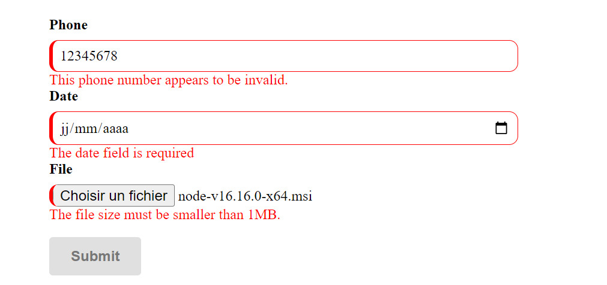

# Pour commencer

`Quickv` *(prononcé "cue-v" en français)* est une bibliothèque JavaScript légère et facile à utiliser pour la validation côté client des formulaires HTML. Avec Quickv, vous pouvez rapidement et facilement ajouter des règles de validation à vos champs de formulaire en utilisant des attributs HTML personnalisés, sans avoir besoin d'écrit du code JavaScript supplémentaire. Les attributs HTML personnalisés de Quickv sont simples à comprendre et à utiliser, ce qui permet aux développeurs de mettre en place rapidement un système de validation robuste sans consacrer beaucoup de temps à la création de fonctions de validation personnalisées ou à l'écriture de code JavaScript complexe. Si vous recherchez une solution simple et efficace pour la validation vos formulaires HTML, Quickv peut être l'outil idéal pour vous.

## Pourquoi utiliser Quickv ?

L'objectif de Quickv est de simplifier le processus de validation et de gagner du temps pour les développeurs, en leur permettant de se concentrer sur d'autres aspects du développement d'une application. En fournissant une solution de validation rapide et facile à utiliser, Quickv peut être un choix attrayant pour les développeurs recherchant une solution efficace pour ajouter une validation côté client à leurs formulaires HTML sans sacrifier beaucoup de temps dans le processus.

## Exemple d'utilisation
```html
 <form id="myForm" > 
      <div>
        <label class="label">Téléphone</label>
        <input type="text" data-qv-rules="required|phone:FR" name="phone" />
        <div data-qv-feedback="phone"></div>
      </div>
      <div>
        <label class="label">Date</label>
        <input
          type="date"
          data-qv-rules="required|date|after:now"
          name="date"
        />
        <div data-qv-feedback="date"></div>
      </div>
      <div>
        <label class="label">Fichier</label>
        <input
          type="file"
          data-qv-rules="required|file|maxFileSize:1MB"
          name="file"
        />
        <div data-qv-feedback="file"></div>
      </div>
      <p><button type="submit" data-qv-submit>Envoyer</button></p>
  </form>
```
Capture d'écran
